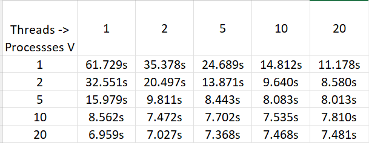

# System Programming Lab 11 Multiprocessing
## Implementation
- Based off lab 11 implementation.
- Created new mandel_info struct to hold all relevant image creation data, in addition to a mutex, int max_threads, and int active_threads
- Added new argument -t, for number of threads. Limit between 1 & 2, defaults to 2 if no argument or invalid argument is provided.
- Adjusted image creation method signature to void* compute_image(void *args) to enable usage in threads.
- Process declares the mandel_info struct, waits for user arguments to be provided, then fills in all the relavant data.
- mandel_info struct is given a reference to a mutex, and sets active_threads to 0.
- Iteratively creates max_threads number of threads, letting them run, before joining them all together in another for loop.
- In each thread, mutex locks the "active_threads", to which each thread incriments the value until it's equal to max_threads, individually un-mutexing after each adjustment.
- Each thread handles an individual horizontal segment of the image, segments are split evenly based off max_threads.
## Data Analysis & Graphs
- Tests were run to generate 50 images under the same conditions (laptop plugged in, all non-nessecary programs closed) each with a different number of processors and thread count.
- Ran 25 tests, with all combinations between 1, 2, 5, 10, 20 threads and processors.
- Based off the table, multiprocessing appeared to impact runtime more positively than threadding.
- This is best shown by looking at the thread = 1 and thread = 2 collumns of the table, compared to the process = 1 and process = 2 collumns.
- An increase in processes has a greater effect on the decrease in time taken than threading.
- This is because the kernel is more able to affectively manage and best allocate resources with multiprocessing, as multiprocessing does not nessecarily indicate multiprocessors in use.
- The OS is able to better optimize multiprocessing than multithreading.

## Results
- There was in fact an optimal sweet spot, around when the quantity processes * threads ≈ 40, with a very notable bias towards more processes over more threads.
- Interesting, the combinations of 5 processes * 10 threads or 10 processes * 5 threads preformed worse than 20 processes & 1 or 2 threads.
- My best guess is that this has to deal with the better potential for optimization with multiprocessing over multi-threading.