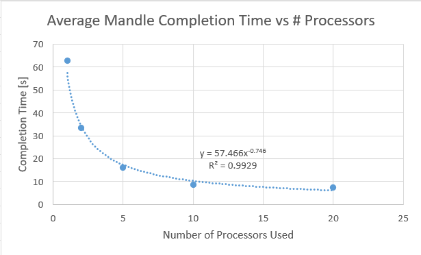
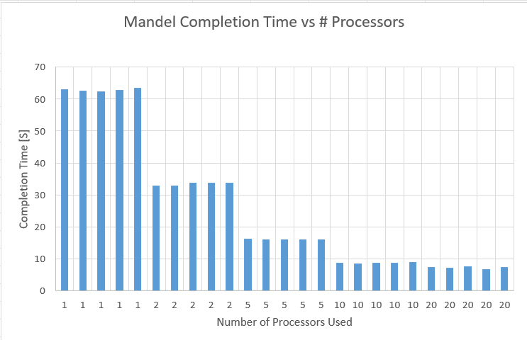

# System Programming Lab 11 Multiprocessing
## Implementation
- Modified mandel.c to utilize variable processing & forking.
- Added two new command line arguments utilizing get opt. n -> # of images, p -> # of max processes.
- Utilized shared memory to have variable out file location and max processes persist between children.
- All the image generation is done exclusively by children, parent only maintains active process count.
## Data Analysis & Graphs
- Tests were run to generate 50 images, each with a different number of processors, aimed at seeing the change in time for completion.
- For each number of processors used (1, 2, 5, 10, 20), 5 different trials were run.
- The average completion time is as follows:
- 1 processor: 62.833 s
- 2 processors: 33.4136 s
- 5 processors: 16.1666	s
- 10 processors: 8.7568	s
- 20 processors: 7.2932 s
- Two graphs were constructed, one scatter plot of the averages with a power curve function, and one bar graph detailing each trial.

## Results
- It's worth noting that the power curve function is only accurate for low process (n < 50) counts, as it predicts that with enough processes that the time for completion would drop to 0 seconds.
- This is not the case, as there is always going to be some inherent overhead required for running more processes, in part capped on the limited number of processors that a device has.
- The length it took to run the program tends to scale inversely with the number of processors, but only up to a limit around 10 processes for 50 images.
- This is again, due to the inherent overhead required with running the program and the number of processors.
- This behavior is most clearly seen with the time taken to run 50 images with 1 processor vs 2, where the time is nearly cut in half.